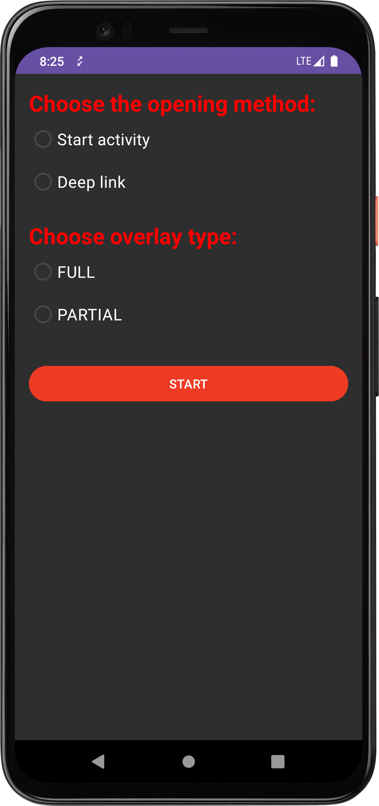
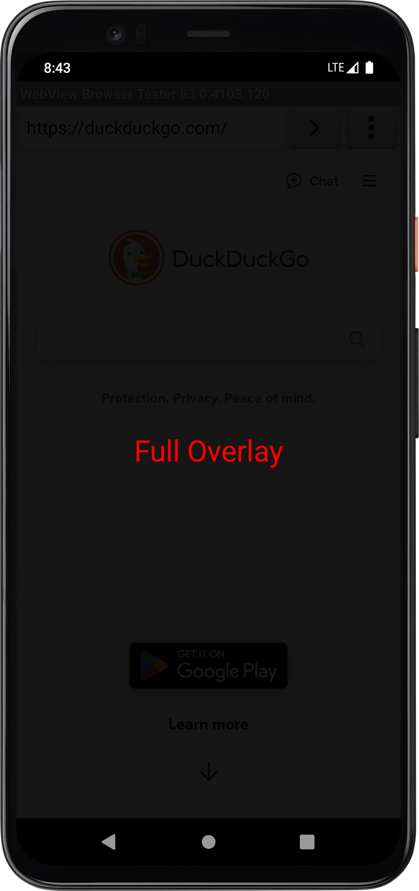
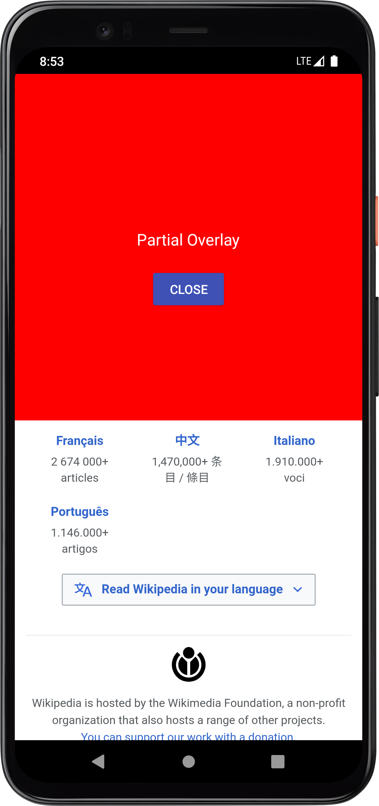

# Tapjacking-PoC (Android)

This Android application is a **proof-of-concept** demonstrating **tapjacking** techniques using full and partial screen overlays. It is intended **for educational and research purposes only**, helping Android developers and security researchers understand the risks associated with screen overlays.

[Here](https://developer.android.com/privacy-and-security/risks/tapjacking) you can read more about Tapjacking.


## Features

- Launch any activity via **package name** and **activity class name**.
- Trigger an app using a **deep link URI**.
- Display a **full-screen overlay**.
- Display a **partial overlay** with custom width and height.

## Screenshots

<div align="center">
    
    <p><em>Main screen</em></p>
</div>

<br>

<div align="center">
    
    
    <p><em>Screenshot showing the full & the partial overlay in action</em></p>
</div>


## How to Use

### Using the APK
1. Download the APK.
2. Install it.

### Using Android Studio
1. Clone the repository:
```bash
git clone https://github.com/frankheat/tapjacking-poc.git
```
2. Open the project in Android Studio.
3. Build and install the app on a device (minSdk 26 - Android 8.0+).


# Operation Modes
### Target Launch Options
- **Start Activity**: Provide a target app's package and full activity class name.
- **Deep Link**: Provide a URI to launch.

### Overlay Options
- **Full**: Launches a fullscreen overlay.
- **Partial**: Launches a partial overlay.


# Required Permissions
This app requires the **SYSTEM_ALERT_WINDOW** permission ("Draw over other apps").