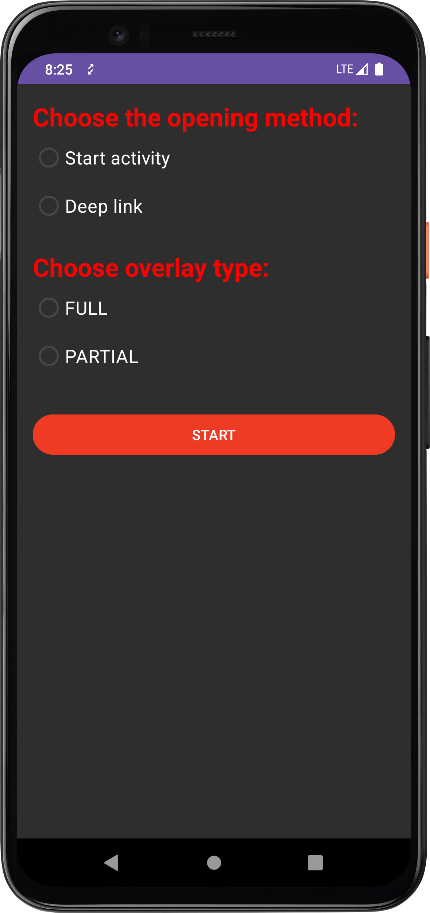
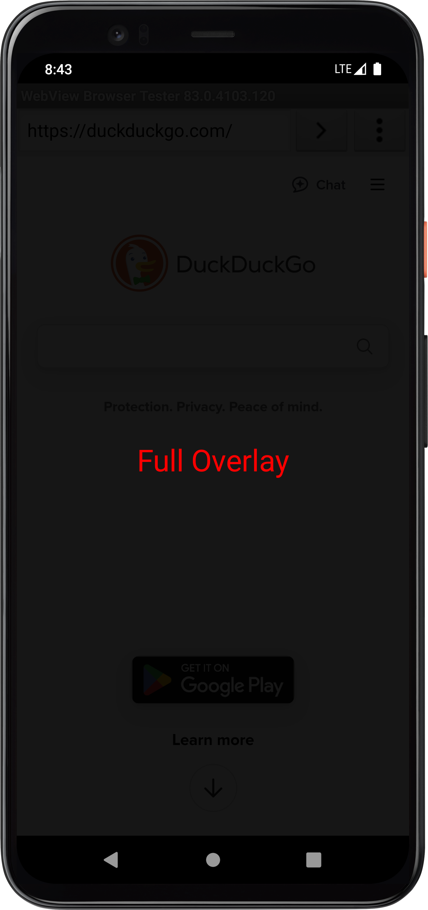

# Tapjacking-PoC (Android)

This Android application is a **proof-of-concept** demonstrating **tapjacking** techniques using full and partial screen overlays. It is intended **for educational and research purposes only**, helping Android developers and security researchers understand the risks associated with screen overlays.

[Here](https://developer.android.com/privacy-and-security/risks/tapjacking) you can read more about Tapjacking.


## Features

- Launch any activity via **package name** and **activity class name**, or browse installed apps directly.
- Trigger an app using a **deep link URI**.
- Display a **full-screen overlay**.
- Display a **partial overlay** that covers the entire screen except a user-defined area, leaving a target button exposed and clickable.

## Screenshots

<div align="center">
    
    
    <p><em>Main screen &nbsp;|&nbsp; Full overlay</em></p>
</div>

<div align="center">
    
    <p><em>Partial overlay</em></p>
</div>


## How to Use

### Using the APK
1. Download the APK.
2. Install it.

### Using Android Studio
1. Clone the repository:
```bash
git clone https://github.com/frankheat/tapjacking-poc.git
```
2. Open the project in Android Studio.
3. Build and install the app on a device (minSdk 26 - Android 8.0+).


## Operation Modes
### Target Launch Options
- **Start Activity**: Provide a target app's package and full activity class name, or use the **Browse** button to pick from the list of installed apps and their exported activities.
- **Deep Link**: Provide a URI to launch.

### Overlay Options
- **Full**: Launches a fullscreen semi-transparent overlay over the target app.
- **Partial**: Opens an interactive selection screen over the target app. Tap two corners to define the area to leave exposed, then confirm. Four opaque overlays are placed around the selected area, covering the rest of the screen while leaving the target button visible and clickable.


## Required Permissions
- **SYSTEM_ALERT_WINDOW** ("Draw over other apps"): required to display overlays. The app redirects to the system settings page if not yet granted.
- **POST_NOTIFICATIONS** (Android 13+): required to show the persistent notification with the Stop action for the partial overlay.
- **QUERY_ALL_PACKAGES**: required to browse the full list of installed apps.